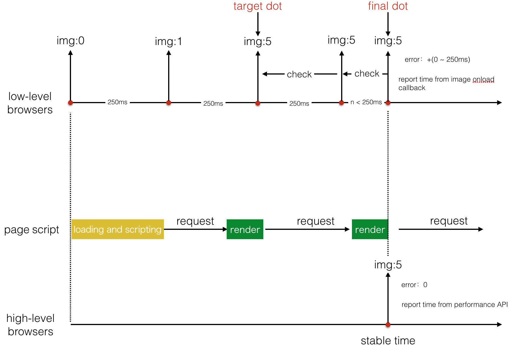

## What is this ?

A tool for computing first screen time of one page with inaccuracy less than 250ms automatically.

## What's the defination of *first screen time* ?

+   If there are images existing in first screen, the defination is: 

    ```
    the time when all images in first screen loaded.
    ```

+   If there is no image existing in first screen, the defination is:

    ```
    the last time when dom changed.
    ```

## Precision

the distance between average tested time and real first screen time is less than 200ms (tested in wifi/fast 3G/slow 3G)

## How To Use

+   compute first screen time automatically

    Run this code before the scripts of page running.

    ```javascript
    var autoComputeFirstScreenTime = require('auto-compute-first-screen-time');
    
    autoComputeFirstScreenTime({

        // required: false
        request: {
            /*
             * the request that will be caught for computing first screen time;
             * RegExp in Array Required;
             * example: [/mtop\.alibaba\.com/i]
             */
            limitedIn: [],

            /* 
             * the request that won't be caught for computing first screen time;
             * RegExp in Array Required;
             * example: [/list\.alibaba\.com/i]
             */
            exclude: []
        },

        // required: false
        onReport: function (result) {
            if (result.success) {
                console.log(result.firstScreenTime)
            } else {
                console.log(result);
            }
        }
    });

    // other scripts of current page
    // ...
    ```

+   compute first screen time by hand when you find it ready

    ```javascript
    var autoComputeFirstScreenTime = require('auto-compute-first-screen-time');

    autoComputeFirstScreenTime.report({
        // required: false
        onReport: function (result) {
            if (result.success) {
                console.log(result.firstScreenTime)
            } else {
                console.log(result);
            }
        }
    });
    ```

+   Dom control

    +   `perf-ignore`

        ignore images inside the tagged dom (tagged dom included)

        ```html
        <div>
            
        </div>
        <div perf-ignore> <!-- ignored -->
             <!-- ignored -->
        </div>

        <div perf-ignore style="background: url(xxx) 0 0 no-repeat;"></div> <!-- ignored -->
        ```

    +   `<body perf-random="0.2"></body>`

        the chance of current page will compute first screen time. `1` by default.

        as this example, the chance with 20% of current page will compute first screen time;

    +   `<body perf-dot></body>`

        force computing first screen time by dotting. (as [Details](https://github.com/hoperyy/auto-compute-first-screen-time#details) below)

    +   `<anytag perf-scroll></anytag>`

        `anytag` means tags like `div / span / ul / ...`.

        Usually, when we get images in first screen, we should firstly get node position by formula as below:

        ```
        var scrollTop = document.documentElement.scrollTop || document.body.scrollTop; // changeable

        var boundingClientRect = imgNode.getBoundingClientRect();
        if ((scrollTop + boundingClientRect.top) < window.innerHeight && boundingClientRect.right > 0 && boundingClientRect.left < window.innerWidth) {
            console.log('this node is in first screen');
        }
        ```

        When `perf-scroll` is added on a tag, part of the formula will change as below:
        
        ```
        var scrollTop = document.documentElement.scrollTop || document.body.scrollTop
        ```
        
        to 
        
        ```
        var scrollTop = document.querySelector('[perf-scroll]').getBoundingClientRect().top;

        if (scrollWrapperClientRect.top < 0) {
            scrollTop = -scrollWrapperClientRect.top;
        } else {
            scrollTop = 0;
        }
        ```

## Support xhr ?

Yes!

## Support fetch ?

Yes!

## Details



## TODO

+   Tests

## LICENSE

BSD